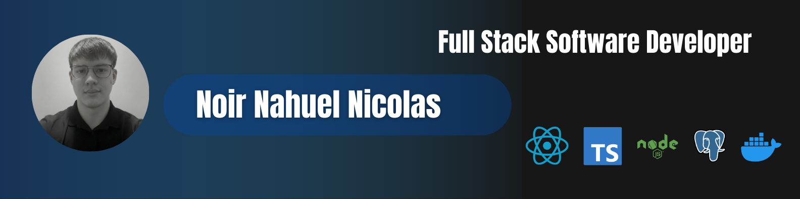

  

# 🫡 Hello, I'm Nahuel Nicolás Noir

🎓 Software Development Technician  
💻 Full Stack & Mobile Developer  

I design and build scalable web and mobile applications using modern technologies,
delivering clean, maintainable, and production-ready software.

---

## 👨🏻‍💻 About Me

🚀 Full Stack Developer with formal technical education and experience in real-world projects.

📱 Mobile Development:
- React Native (Hybrid applications)
- GymPoint – Fitness mobile app

🌐 Frontend:
- React
- TypeScript
- Tailwind CSS

⚙️ Backend:
- Node.js
- Express
- REST API design
- Authentication & authorization
- Database modeling
- PostgreSQL / MongoDB

🛠 DevOps & Tools:
- Docker
- Git & GitHub

---

---

## 🤝 Connect With Me

I'm open to new opportunities.

For professional inquiries, feel free to contact me at:

